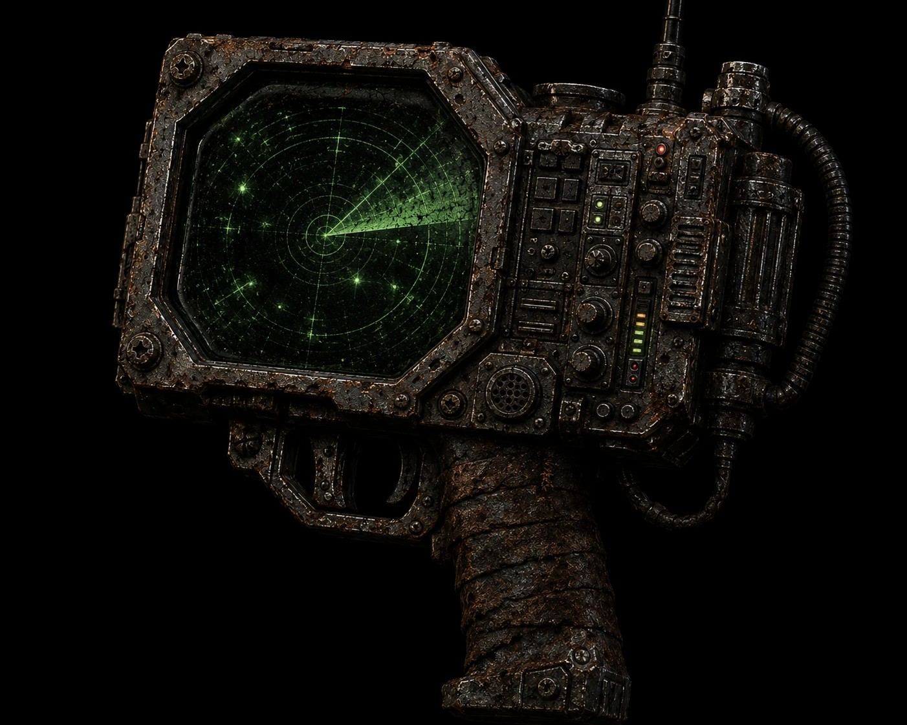

# OffsetScan

<p align="center">
  
</p>

[](https://github.com/warpedatom/OffsetScan/actions/workflows/ci.yml)
[](./LICENSE)

A standalone, native, corpus-scale companion to [OffsetInspect](https://github.com/warpedatom/OffsetInspect).

OffsetInspect's static-triage helpers (`Get-OffsetPEInfo`, `Get-OffsetEntropy`,
`Get-OffsetString`, `Get-OffsetIOC`) are cross-platform PowerShell and work
great for single-file, interactive analysis. OffsetScan exists for the other
end of the workload: **thousands of files**, where PowerShell's per-file
overhead adds up and a parallel, no-GC native core pays for itself.

OffsetScan does not touch AMSI or Microsoft Defender — that stays exactly
where it belongs, as Windows-only functionality in OffsetInspect. OffsetScan
only does the read-only, cross-platform static-analysis layer: PE parsing,
entropy, string extraction, hashing, and (optionally) YARA matching.

## Design contract

Every OffsetScan output struct (`src/schema.rs`) mirrors the equivalent
OffsetInspect PowerShell object field-for-field, so the two tools are
interchangeable at the JSON layer:

| OffsetScan (Rust)              | OffsetInspect (PowerShell) equivalent   |
| ------------------------------- | ---------------------------------------- |
| `offsetscan pe`                 | `Get-OffsetPEInfo`                       |
| `offsetscan entropy`            | `Get-OffsetEntropy`                      |
| `offsetscan strings`            | `Get-OffsetString`                       |
| `offsetscan ioc`                | `Get-OffsetIOC`                          |
| `offsetscan yara` (feature-gated) | `Invoke-OffsetYaraScan`                |

The struct definitions have been verified field-for-field against the
authoritative `docs/OUTPUT-SCHEMA.md` and the real OffsetInspect 3.x objects,
and cross-checked at runtime: `offsetscan ioc` and `Get-OffsetIOC` produce
identical panels for the same file — **including the imphash**. The
serialized field names (`MD5`/`SHA1`/`SHA256`/`IsPE`/`IsPE32Plus`) are locked
by unit tests so the interchange contract can't silently drift.

### Verified parity

Both engines against the same Windows system DLL — `offsetscan ioc` on the left,
`Get-OffsetIOC | ConvertTo-Json` on the right:

```text
File                    C:/Windows/System32/kernel32.dll
FileSize                836232
MD5                     46e3ab50afcb6d871b70676f562e01ce
SHA1                    732af3ed087e2033d7e7ccaa0f4498deb2e46e8c
SHA256                  26410f4948e0ed66936880596e2b5a59efce481a7c97086049b385f00325c341
OverallEntropy          6.361191
HighEntropyWindows      25
PrintableStringCount    5665
IsPE                    true
Machine                 x64 (AMD64)
ImpHash                 a6c6d5a8f6e13c556e2c3fbc4a3dc407
ImportedDllCount        104
HasOverlay              true
OverlaySize             17032
```

Every field matches, including the imphash and entropy to six decimal places.

String extraction is compared as a set, not just a count. For `ntdll.dll`
(2,517,928 bytes), `offsetscan strings` and `Get-OffsetString` both return
**32,506** hits that agree exactly on offset, encoding, and value — zero entries
unique to either engine.

One caveat when reproducing this: `Get-OffsetString` reads in 1 MiB windows by
default and a string straddling a window seam is split in two, which inflates
PowerShell's count by one per affected seam on files larger than the window.
That is an artifact of the windowed read, not a disagreement about content —
pass a `-WindowSize` large enough to hold the file to compare like for like.
OffsetScan reads the whole file and is unaffected.

## Build

```
cargo build --release
# With optional YARA support (requires the YARA engine installed):
cargo build --release --features yara-scan
```

## Usage

```
offsetscan pe ./sample.exe
offsetscan pe ./sample.exe --offset 0x5F85   # map a byte offset to its PE section
offsetscan entropy ./payload.bin --window 256 --high-threshold 7.2
offsetscan strings ./sample.bin --min-length 6
offsetscan ioc ./sample.exe

# Corpus mode (any subcommand):
offsetscan ioc ./samples --recurse

# Streaming output for large corpora — one compact JSON object per line,
# emitted as each file finishes so peak memory stays flat:
offsetscan ioc ./samples --recurse --ndjson

# Flat CSV for spreadsheets/SIEM (ioc only; columns match the JSON field names):
offsetscan ioc ./samples --recurse --csv > iocs.csv
```

By default all commands emit a pretty-printed JSON array to stdout, matching
OffsetInspect's JSON-mode convention (always an array, even for one result).
Add `--ndjson` for newline-delimited JSON — pipe-friendly and constant-memory
over hundreds of thousands of files. Add `--csv` (the `ioc` subcommand only, as
the others produce nested data) for a flat header + one-row-per-file table whose
columns match the JSON field names — ready for Excel or a SIEM import.

## Consuming from PowerShell

OffsetInspect 3.1.0+ ingests OffsetScan's IOC JSON directly, so a corpus report
runs off the native engine instead of re-scanning each file in PowerShell:

```powershell
offsetscan ioc ./samples --recurse > ./ioc.json
$results | Export-OffsetThreatReport -Path ./engagement.md -IocJsonPath ./ioc.json
```

Because the JSON shape matches `Get-OffsetIOC` field-for-field, any consumer of
that shape accepts OffsetScan's output as a drop-in, faster-at-scale alternative.

## What's intentionally NOT here

- AMSI / Microsoft Defender scanning — stays in OffsetInspect (Windows-only,
  needs the actual providers).
- Detection-boundary bisection search — that's a stateful, provider-driven
  workflow (`Invoke-OffsetThreatScan`), not a stateless corpus pass.
- ClamAV integration — `clamscan` process-spawning has no real parallel-corpus
  benefit from a Rust rewrite; left in PowerShell.

## Status

Validated against OffsetInspect and covered by a unit-test suite (Shannon
entropy vectors, string offsets, PE helpers, and the parity-critical schema
field names) that runs in CI on Linux and Windows. `resource_size` is computed
from the PE resource data directory.

The `yara-scan` feature adds an `offsetscan yara` subcommand whose records
(`File`/`Rule`/`StringId`/`Offset`/`OffsetHex`/`Data`) are verified identical to
`Invoke-OffsetYaraScan`'s on the same rules and sample. It is **feature-gated and
off by default** — building it needs a C toolchain and `libclang` (the `yara` crate
compiles a vendored `libyara` via bindgen), so the default binary (and everything on
crates.io / the release page) does not include it. A CI job builds and tests the
feature on Linux (installing `libclang` for bindgen). Non-printable match bytes are
decoded lossily into `Data`, which can differ from the YARA CLI's textual rendering
for binary matches.

```
# needs: cargo build --release --features yara-scan
offsetscan yara ./sample.bin --rules ./rules/malware.yar
offsetscan yara ./corpus --recurse --rules ./a.yar --rules ./b.yar
```
